## 	:raising_hand_man: Hey, I'm Maitra.

I am currently a Devops Intern @ General Dynamics - Mission Systems and study Software Engineering at the University of Calgary!

I am passionate about backend and cloud development, so to further my knowledge in this field of software, I took a dive into the realm of Go programming... Interning and programming on the side has been a challenge, but I look forward to pushing out a project using Go in the coming months!

## :sandwich: Tech Stack

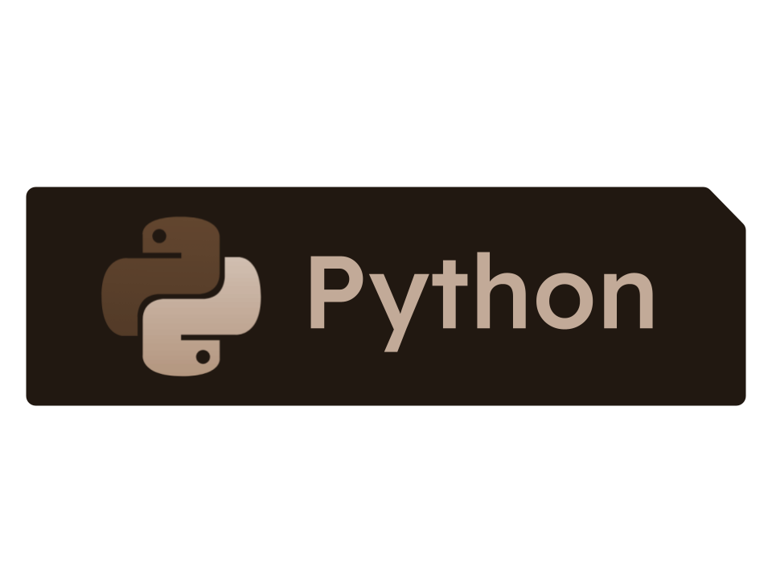  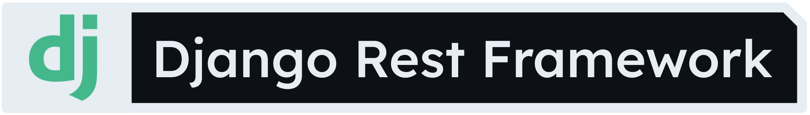 
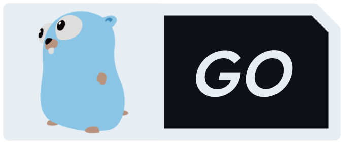 
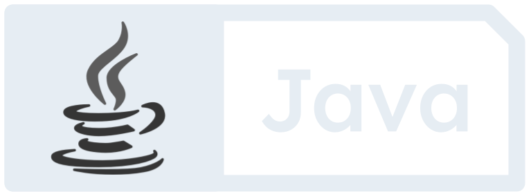 
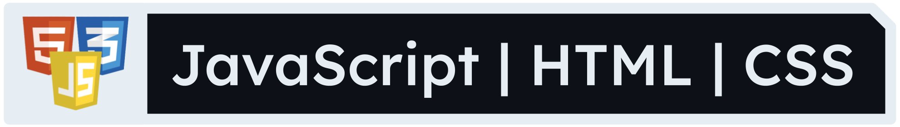 
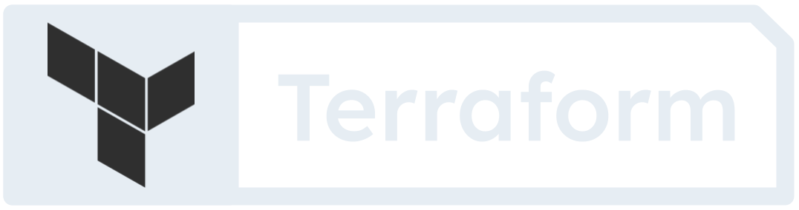 
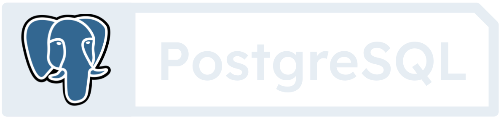 
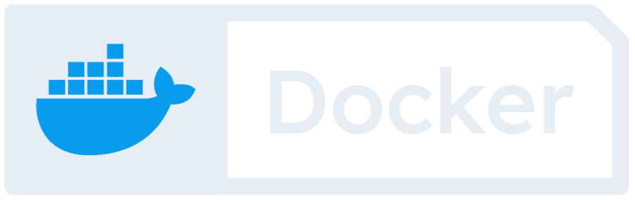 
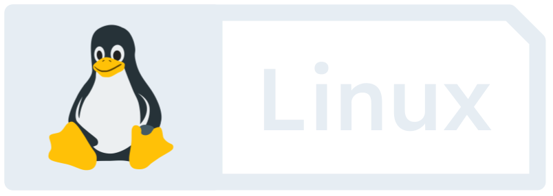 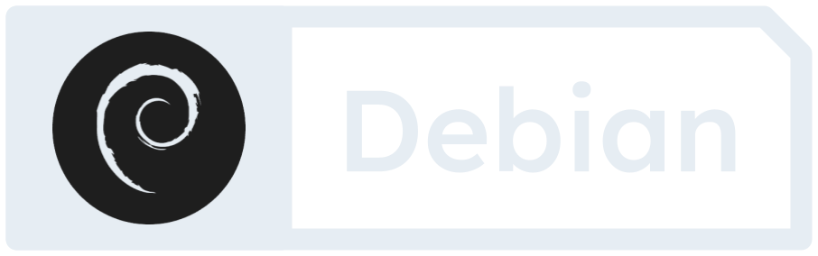 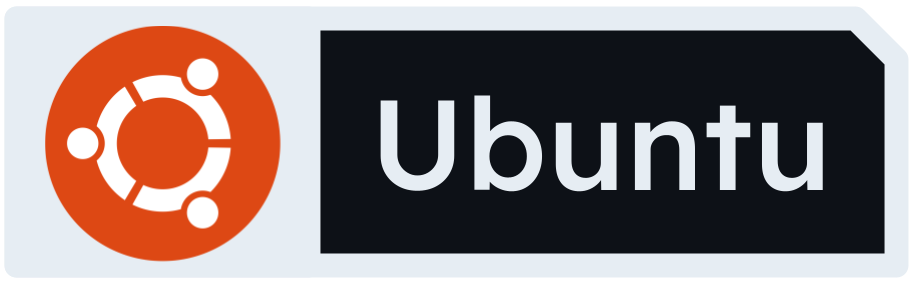

##  Amazon Web Services Stack

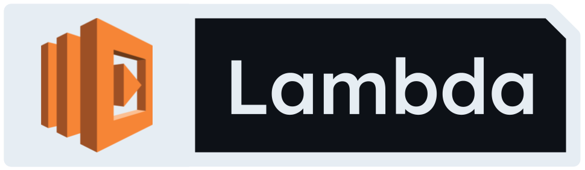 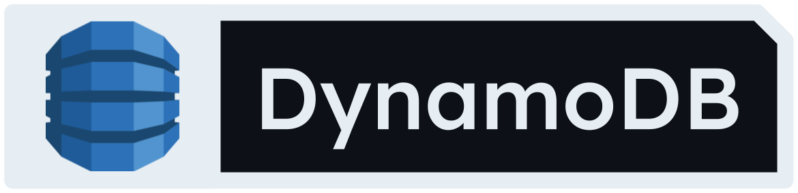 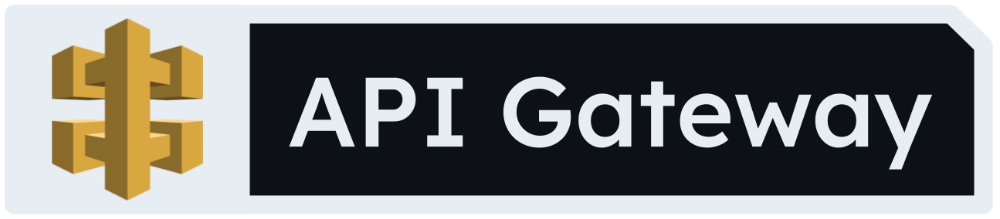 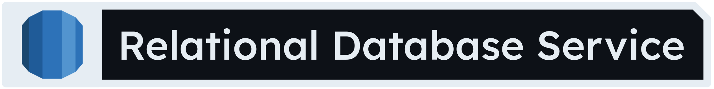 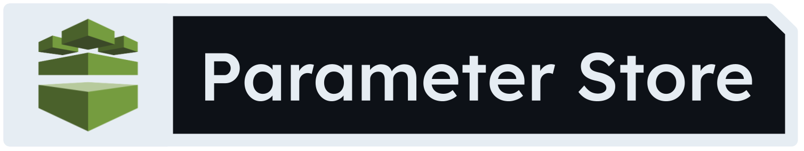 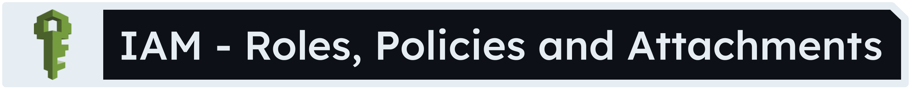 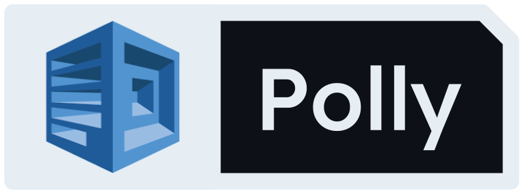

#### Feel free to check out my projects and see exactly how I implement these technologies!
