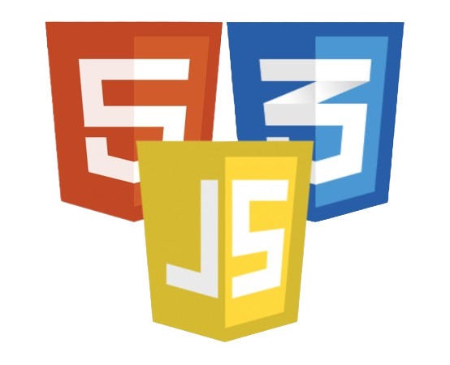
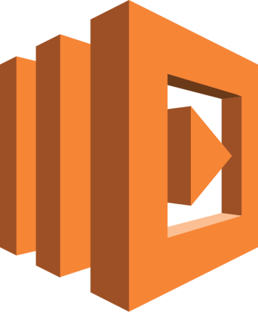
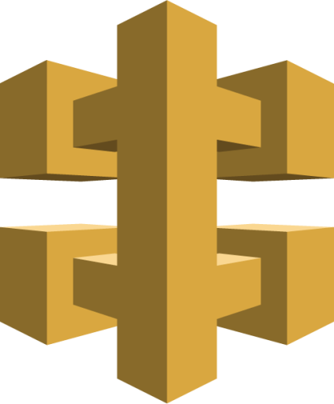
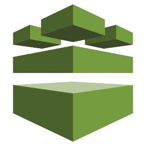
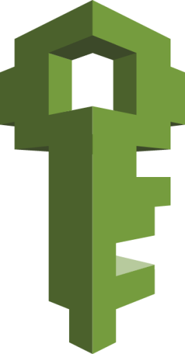
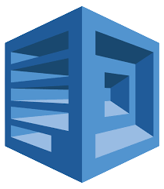
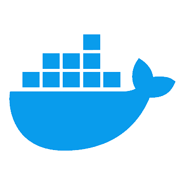

## 	:raising_hand_man: Hey, I'm Maitra.

:mortar_board: I am a 3rd year Software Engineering student at the University of Calgary with an interest in backend and cloud development!

## :sandwich: Tech Stack

-  Python
  -  Django
  -  Django REST Framework
-  HTML | CSS | JavaScript
- 

 AWS
 Lambda  DynamoDB  API Gateway  RDS  Parameter Store  IAM Roles, Policies and Policy Attachments  Polly

-  Terraform
-  PostgreSQL
-  Docker
-  Linux
  -  Debian

#### Feel free to check out my projects and see exactly how I implement these technologies!
