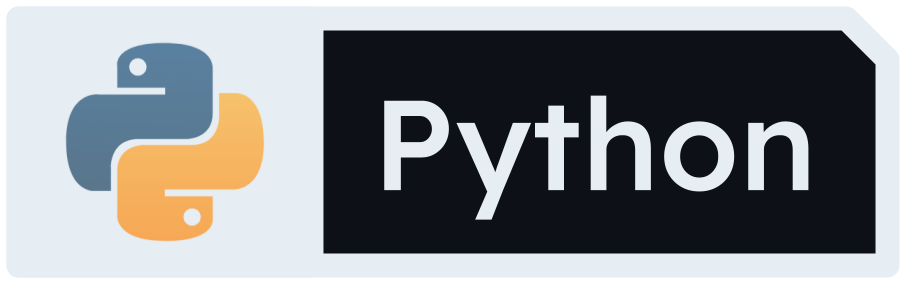
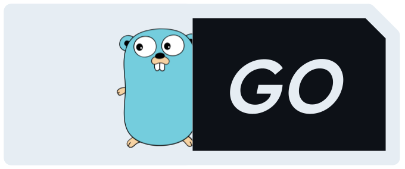
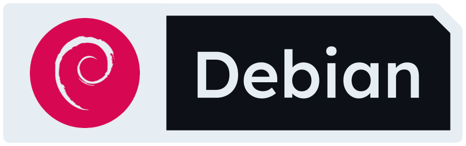

## 	:raising_hand_man: Hey, I'm Maitra.

This summer I wrapped up an internship at **Amazon Web Services (AWS)** as a **Software Development Engineer**, and prior to that I interned as a **DevOps Engineer** at **General Dynamics**. Currently, I am studying **Software Engineering** at the **University of Calgary**!

I am passionate about backend and cloud development, so to further my knowledge in this field of software, I took a dive into the realm of Go programming... Interning, going to classes and programming on the side has been a challenge, but I am working on something that has been on the back-burner for some time now. I can't wait to be able to share it. Coming Soon 👀

## :sandwich: Tech Stack

   
 
 
 
 
 
 
  

##  Amazon Web Services Stack

      

#### Feel free to check out my projects and see exactly how I implement these technologies!
