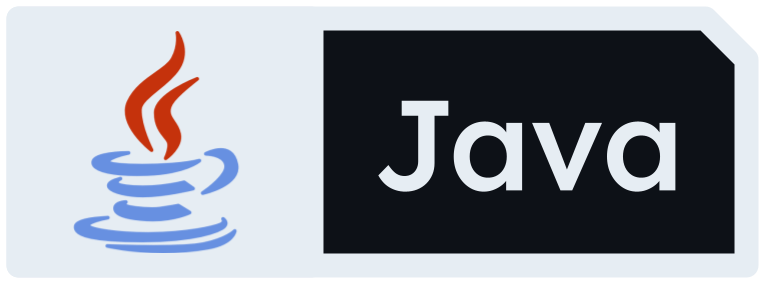
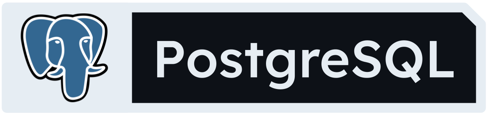

## 	:raising_hand_man: Hey, I'm Maitra.

:mortar_board: I am a 3rd year Software Engineering student at the University of Calgary with an interest in backend and cloud development!

## :sandwich: Tech Stack

   
 
 
 
 
 
 
 

#### Feel free to check out my projects and see exactly how I implement these technologies!
